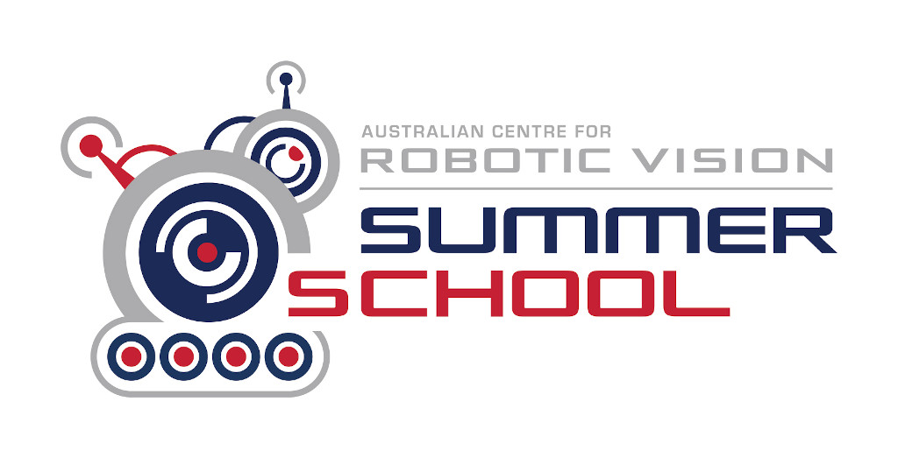

# Official Repository RVSS

The material here provided was developed as part of the [Robotic Vision Summer School](https://www.rvss.org.au/).

---
# Workshops
Please see this [separate README](./README_Workshop.md).

---
# Lectorials
You can run the notebooks via Colab: http://colab.research.google.com/github/Tobias-Fischer/RVSS.

Links to slide decks and information about the lectorials will appear below.

## Lectorial A: Robotic Vision
Presented by Peter Corke, Queensland University of Technology, and Donald G. Dansereau, University of Sydney

## Lectorial B: Spatial Awareness
Presented by Tom Drummond, University of Melbourne

## Lectorial C: Visual Learning
Presented by Simon Lucey, University of Adelaide

## Lectorial D: Reinforcement Learning
Presented by Pamela Carreno-Medrano, Monash University

## Deep Dive I 
Presented by Richard Hartley, Australian National University

## Deep Dive II
Presented by Hanna Kurniawati, Australian National University

## Deep Dive III
Presented by Miaomiao Liu, Australian National University
