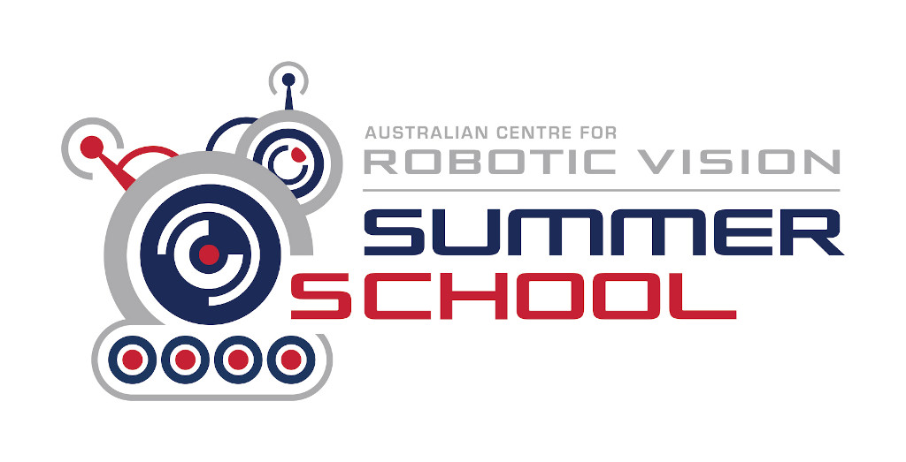

# Official Repository RVSS 2026

The material here provided was developed as part of the [Robotic Vision Summer School](https://www.rvss.org.au/).

Under construction. Slides will appear as they become available.

---
The main RVSS [Website](https://www.rvss.org.au/) has information about the school and its program.

The RVSS [Workshop Repo](https://github.com/rvss-australia/RVSS_Need4Speed) has all materials for the Need 4 Speed workshop held at the summer school.

---
# Lectures and Hands-On Sessions
You can run the notebooks via Colab: http://colab.research.google.com/github/rvss-australia/RVSS.

Links to slide decks and information about the lectures will appear below.

---
## Throughout the week: Math Moments, Feras Dayoub
[Slides](https://www.dropbox.com/scl/fo/xgb2sujrcnaprywab81fr/AISiMMeCujuzOnWyJVU5H9M?rlkey=4s7bim827wygj9p0u0ur299up&e=1&st=p7gos4sj&dl=0)

---
## Sunday / Monday

I have set pre-reading and pre-watching resources if you're keen.  Follow the links below.

### [Introduction to Robotic Vision](Robotic_Vision/README.md), Peter Corke
### [Image Formation](Robotic_Vision/README.md), Peter Corke
### [Image Processing](Robotic_Vision/README.md), Peter Corke
### [Feature Extraction](Robotic_Vision/README.md), Peter Corke
### Deep Dive: [From Lab to Launch: How (and Why) to Start an AI & Robotics Company in Australia](Startups/RVSS_Robotics(and_AI)Start-ups-SueKeay_Feb2026.pdf), Sue Keay

---
## Tuesday

### [Deep Learning](Visual_Learning/RVSS2026-IntroDL.pdf), Simon Lucey
### [World Models *updated](Spatial_Awareness/Slides/RVSS-2026-All.pdf), Tom Drummond
### [Transformers](Visual_Learning/RVSS2026-Tokens_and_Transformers.pdf), Simon Lucey
### Deep Dive: [Planetary Rover Autonomous Navigation](PlanetaryRovers/RVSS2026-DeepDive-PlanetaryRovers_c.pdf), Thierry Peynot

---
## Wednesday

### [Policy Learning](Reinforcement_Learning/Intro%20to%20Policy%20Learning.pdf), Dana Kulic
### [Foundation Models](Visual_Learning/RVSS2026-Foundation_Models.pdf), Simon Lucey
### [Imitation Learning](Reinforcement_Learning/Imitation%20Learning.pdf), Dana Kulic
### Deep Dive: [Underwater Robotic Vision for Ecosystem Monitoring and Reef Restoration](UnderwaterVision/ScarlettRaine-Slides-PDF.pdf), Scarlett Raine

---
## Thursday

### [Classical SLAM](Spatial_Awareness/Slides/RVSS-2026-All.pdf), Tom Drummond
### [Multi-Task Learning](Reinforcement_Learning/Multi-TaskLearning.pdf), Dana Kulic
### [Learning-Based SLAM](Spatial_Awareness/Slides/RVSS-2026-All.pdf), Tom Drummond
### Deep Dive: [Calibration and Pose](CalibrationConic/Calibration-2up-reduced.pdf), preview paper [here](CalibrationConic/Arxiv-preview.pdf), Richard Hartley

---
