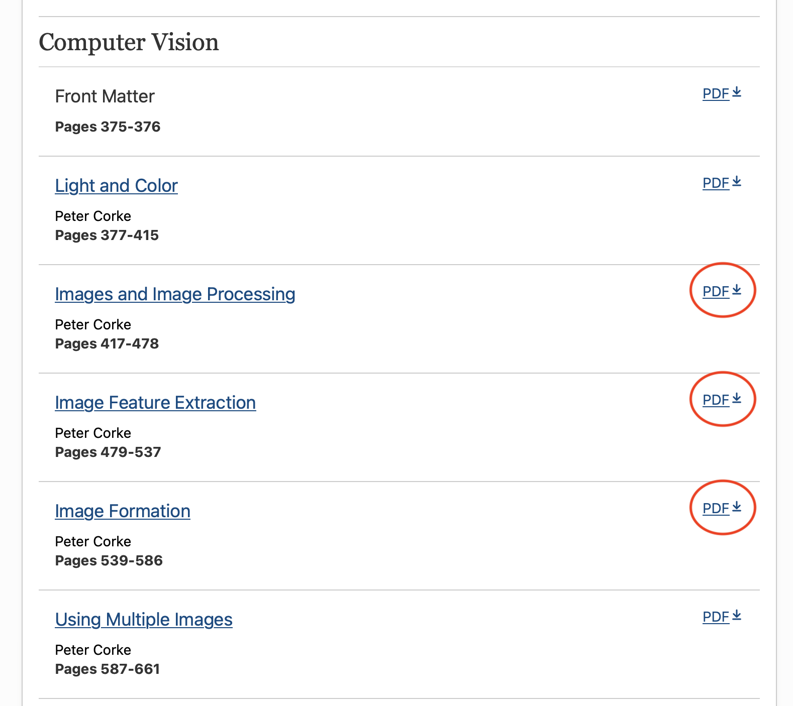
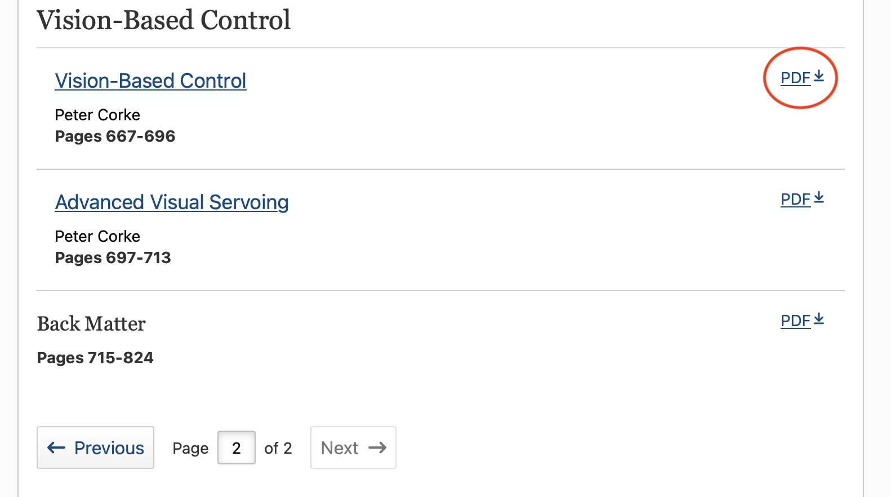
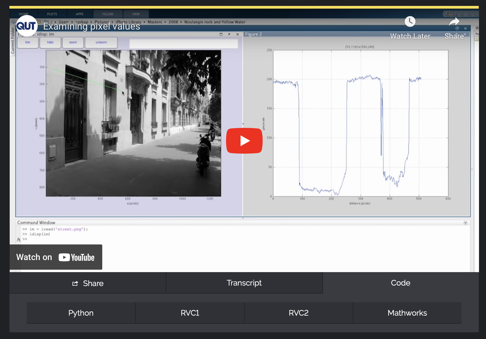

# Robotic Vision (A) stream

There are four sets of learning resources for each topic that I cover, described in a bit more detail below.

I teach general principles but to put the ideas into practice we need to write code.  There are myriad choices of language
and library/package/toolbox to choose from.  In the past I've done a lot in MATLAB but now I'm working with Python, and Python is
what we will use for the summer school.

## Lectures

The PDFs of my lecture slides are provided in advance.  Feel free to load them into your tablet to annotate as we go along.


## Book

The material that I present is covered in more detail in my book Robotic, Vision & Control, 3rd edition 2023.  There are two versions of this book:

* [Robotic, Vision & Control: Fundamental algorithms in **Python**](https://link.springer.com/book/10.1007/978-3-031-06469-2)
* [Robotic, Vision & Control: Fundamental algorithms in **MATLAB**](https://link.springer.com/book/10.1007/978-3-031-07262-8)

If you are studying at a university it is highly likely that you can download for free the chapters of this book from the links above.
For this course grab the chapters from the latter part of the book





Feel free to grab any other chapters that might take your fancy.  Chapter 2 is a good introduction to representing position
and orientation in 3D space, Appendix B is a terse refresher on linear algebra and geometry.


## Videos

There are a set of free online video resources (the QUT Robot Academy) that might be useful as a refresher.  

* [Homogeneous coordinates](https://robotacademy.net.au/lesson/homogeneous-coordinates-recap/) (5 mins)
* [Position, orientation & pose in 3D space](https://robotacademy.net.au/masterclass/3d-geometry/) (multiple lessons, 60 mins total)

Code examples in these videos are done with MATLAB, but underneath each video is a code tab, and below that is a tab that allows you to select a 
"translation" of the code used in the video to different languages and toolboxes.



I will mention other, lecture-specific, Robot Academy videos below.


## Jupyter Notebooks

There a selection of Jupyter/Python notebooks that will help to embed knowledge from each lecture.  You can run them on Google Colab, with zero install, by
clicking the  button below.  

Alternatively, you can run them locally on your laptop, and that requires that you first install the [Machine Vision Toolbox for Python](https://github.com/petercorke/machinevision-toolbox-python)
```
pip install machinevisiontoolbox
```
Python 3.9 or newer is recommended.

I would highly recommend that you use [Miniconda](https://docs.conda.io/projects/miniconda/en/latest) and create an environment for your RVSS code.
```
conda create -n RVSS python=3.10
conda activate RVSS
pip install machinevisiontoolbox
```

# Lecture resources

## Lecture A1 Image Processing

* [Lecture PDF file](Slides/A1-Image-processing.pdf)

* Robotics, Vision & Control: Chapters 11 and 12

* Robot Academy video masterclasses (each is a collection of short videos, ~1h total run time)
  * [Getting images into a computer](https://robotacademy.net.au/masterclass/getting-images-into-a-computer/)
  * [Image processing](https://robotacademy.net.au/masterclass/image-processing/)
  * [Spatial operators](https://robotacademy.net.au/masterclass/spatial-operators/)
  * [Feature extraction](https://robotacademy.net.au/masterclass/feature-extraction/)

* Jupyter/Python Notebooks

  * [`image-processing.ipynb`](image-processing.ipynb), fundamentals of image processing as discussed in the lecture <a href="https://colab.research.google.com/github/rvss-australia/RVSS/blob/main/Robotic_Vision/image-processing.ipynb" target="_parent"></a>
  * [`image-features.ipynb`](image-features.ipynb), fundamentals of corner features as discussed in the lecture <a href="https://colab.research.google.com/github/rvss-australia/RVSS/blob/main/Robotic_Vision/image-features.ipynb" target="_parent"></a>
  * [`finding-blobs.ipynb`](finding-blobs.ipynb), extension to blob finding and blob parameters <a href="https://colab.research.google.com/github/rvss-australia/RVSS/blob/main/Robotic_Vision/finding-blobs.ipynb" target="_parent"></a>
  * [`fiducials.ipynb`](fiducials.ipynb), extension to finding ArUco markers (QR-like codes) in an image <a href="https://colab.research.google.com/github/rvss-australia/RVSS/blob/main/Robotic_Vision/image-features.ipynb" target="_parent"></a>

## Lecture A2  Camera imaging and geometry

* [Lecture PDF file](Slides/A2-Image-geometry.pdf)

* Robotics, Vision & Control: Section 13.1

* Robot Academy video masterclasses (each is a collection of short videos, ~1h total run time)

  * [How images are formed](https://robotacademy.net.au/masterclass/how-images-are-formed/)
  * [The geometry of image formation](https://robotacademy.net.au/masterclass/the-geometry-of-image-formation/)

* Jupyter/Python Notebooks

  * [`camera_animation.ipynb`](camera_animation.ipynb), interactive animation of point projection for central projection model<a href="https://colab.research.google.com/github/rvss-australia/RVSS/blob/main/Robotic_Vision/camera_animation.ipynb" target="_parent"></a>
  * [`camera.ipynb`](camera.ipynb), <a href="https://colab.research.google.com/github/rvss-australia/RVSS/blob/main/Robotic_Vision/camera.ipynb" target="_parent"></a>
   * [`homogeneous-coords.ipynb`](homogeneous-coords.ipynb), refresher on homogeneous coordinates including an interactive animation<a href="https://colab.research.google.com/github/rvss-australia/RVSS/blob/main/Robotic_Vision/homogeneous-coords.ipynb" target="_parent"></a>
  * [`calibration2d.ipynb`](calibration2d.ipynb), extension, calibrating a camera using a set of chequerboard images  <a href="https://colab.research.google.com/github/rvss-australia/RVSS/blob/main/Robotic_Vision/calibration2d.ipynb" target="_parent"></a>
  * [`fiducials.ipynb`](fiducials.ipynb),  extension, finding the pose and identity of ArUco (QR codes) in an image <a href="https://colab.research.google.com/github/rvss-australia/RVSS/blob/main/Robotic_Vision/fiducials.ipynb" target="_parent"></a>

## Lecture A3

* [Lecture PDF file](Slides/A2-Image-formation.pdf)

* Robotics, Vision & Control: Chapter 15

* Robot Academy video masterclasses (each is a collection of short videos, ~1h total run time)

  * [Vision and motion](https://robotacademy.net.au/masterclass/vision-and-motion/)

* Jupyter/Python Notebooks
