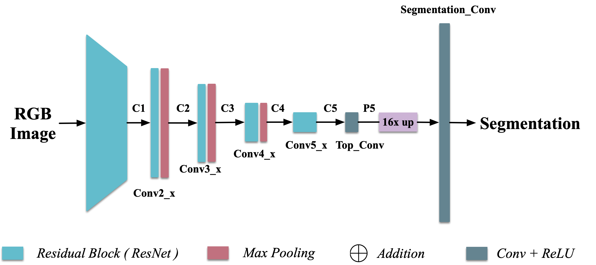

# RVSS 2022 Workshop
The repository contains the CNN module for the fruit detection task.
This is a light-weight fully convolutional network that infers at approximately 3 fps on a CPU. 

Current input resolution is set to 256x192, the segmentation mask is a quarter of the input, i.e. 128x96
## Before you start
[Follow the instructions here to train the fruit segmentation network](https://sites.google.com/view/rvss2022workshop/neural-network?authuser=0)

## Network Architecture
### Baseline Architecture:

### With Skip Connections:

The network has a auto-encoder, decoder structure.
ResNet18 with pre-trained weights is used as the auto-encoder. 
The decoder is inspired by the "lateral connection" proposed by Lin et al. in _Feature Pyramid Network for Object Detection, 2016_. 

 

ResNet Architecture             |  Lateral Connection
:-------------------------:|:-------------------------:
  |  

